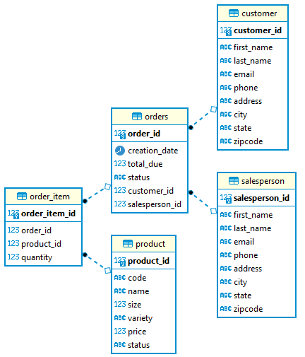

# Introduction
This application interacts with a PostgreSQL database to perform CRUD operations. Java Database Connectivity provides
the framework for interacting with the database. Operations are performed using the `JDBCExecutor` class and the
Data Access Object outlined in `CustomerDAO`. Maven was used to help construct the project and install the necessary
dependencies.

# Implementation
## ER Diagram

## Design Patterns
The `CustomerDAO` class is able to perform basic CRUD operations; it can create a customer, search for a customer by 
id, update a given customer and delete a customer by id. There is also a method for retrieving all the customers but
this was not implemented.

There are five tables as outlined in the ER diagram. Each table has id fields that serves as either the table's
primary key or a foreign key linking it to another table.

# Test
The database and its test data was generated with given SQL scripts. The code was tested using the `JDBCExecutor`
class by creating sample customers, retrieving them, updating them and deleting them with the `CustomerDAO` class.
Print statements were used to verify that the results were correct.