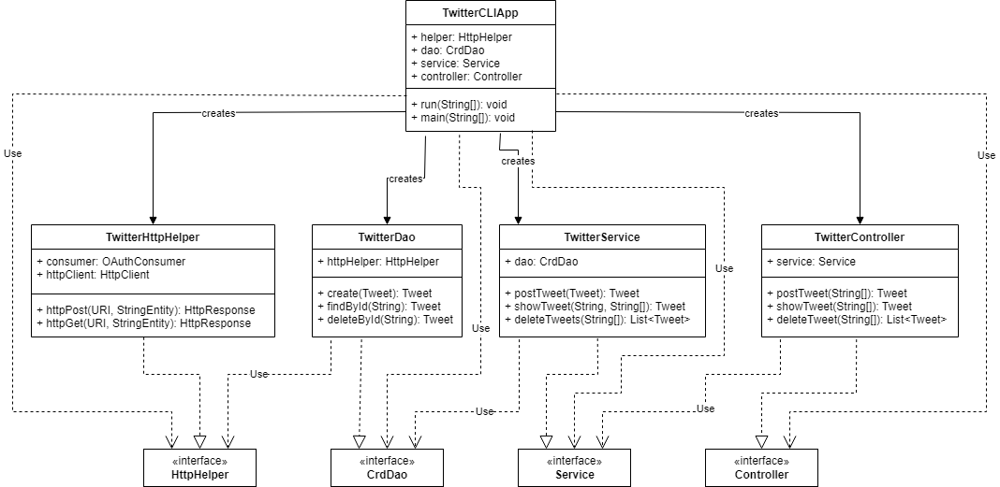

# Introduction
This application will read user input containing a keyword and a set of arguments and perform a REST API operation
depending on what information was included in the user input. A Twitter Developer account with elevated access was 
created along with a pair of SSH keys for authentication. Notable technologies used in this application include OAuth
for executing HTTP requests, Google GSON for parsing JSON formatted strings into Tweet objects, Mockito and JUnit to 
test and verify each of the application's methods. Finally, Maven and Spring were used for dependency management and 
Docker was used for deployment.

# Quick Start
- how to package your app using mvn?
- how to run your app with docker?

# Design
## UML diagram

## Components
- `HttpHelper` executes HTTP requests using given URIs and String Entities.
- `CrdDao` prepares URIs for the `HttpHelper` component and parses the responses into Tweet objects.
- `Service` verifies the input of each HTTP request, ensuring only valid requests are made.
- `Controller` parses the user input of each HTTP request.
- `TwitterCLIApp` initializes the application and creates each component.

## Models
When designing the model for the Tweet object, we tried to make the model as similar to an actual tweet as possible.
However, due to the scope of the project, we had to settle for a simplified version of Twitter's tweet with many of
the fields left out. Our Tweet object contains the following attributes:

- `created_at` contains the timestamp indicating when this tweet was created.
- `id` contains this tweet's id for retrieval operations.
- `id_str` contains this tweet's id but in a String format.
- `text` contains this tweet's content.
- `entities` is a collection which contains this tweet's hashtags and user mentions. Each hashtag and user mention 
also contains indices indicating their start and finish within the text as well as the relevant text or user 
respectively.
- `coordinates` contains the location where this tweet was created using a latitude, longitude format.
- `retweetCount` contains the number of times this tweet was retweeted.
- `favouriteCount` contains the number of times this tweet was favourited.
- `retweeted` indicates whether this tweet was retweeted or not.
- `favourited` indicates whether this tweet was favourited or not.

## Spring
- How you managed the dependencies using Spring?

# Test
Unit and Integration test scripts were written using JUnit. Mockito was used to mock external methods and classes in
unit tests so only the code in the method in question was tested. JUnit annotations such as `@Before` allowed us to 
initialize key components such as dependency classes and SSH keys before each test. 

## Deployment
How did you dockerize your app.

# Improvements
- While it may be generally frowned upon to skip parts of the testing process, I would have omitted writing the
majority of the unit tests in this project. The Twitter API as well as external methods are too central in the
implementation of each method. Thus, after mocking each method and class, it is meaningless to test what code is left
in a unit setting.
- If the scope allowed for it, I would have liked to implement a Graphical User Interface for this application. 
Issuing commands with a terminal can be confusing whereas using an interface with buttons and text fields is much
simpler.