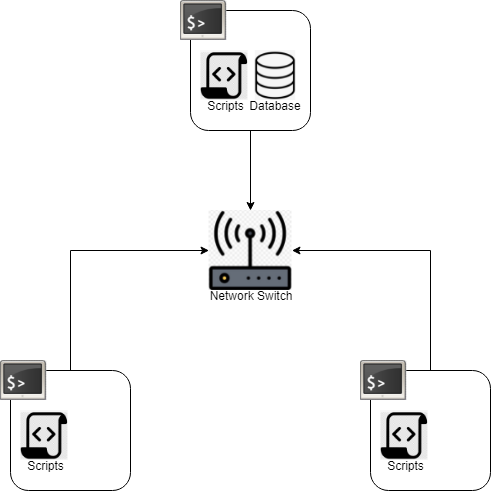

# Introduction

The Jarvis Linux Cluster Administration manages about 10 nodes each using the CentOS 7 Linux distribution. These nodes are also connected through a switch and are able to communicate using internal IPv4 addresses. The purpose of this project is to track and record the performance of each node as well as the resources each node uses. This data will be stored in an RDBMS database and used to generate reports for plans regarding future nodes.

# Quick Start

Start a PSQL instance.
```
./scripts/psql_docker.sh create [db_username] [db_password]
./scripts/psql_docker.sh start|stop
```

Create hardware specification and hardware usage tables.
```
psql -h localhost -U postgres -d host_agent -f sql/ddl.sql
```

Insert hardware specification data into the database.
```
./scripts/host_info.sh [PSQL host] [PSQL port] [database name] [PSQL user] [PSQL password]
```

Insert hardware usage data into the Database.
```
./scripts/host_usage.sh [PSQL host] [PSQL port] [database name] [PSQL user] [PSQL password]
```

Set up Crontab.
```
# Edit crontab jobs
bash> crontab -e

# The crontab jobs panel uses the vim text editor. Press 'i' to being inserting and add the following command to the jobs panel.
# Then press 'esc' and type ':wq' to exit and save changes. This command will add to the 'host_usage' table every minute
* * * * * bash [path to repository]/scripts/host_usage.sh localhost 5432 host_agent postgres password > /tmp/host_usage.log

# List crontab jobs
bash> crontab -l
```

# Implementation

The project will be implemented with tools including but not limited to Linux command lines, Bash scripts, PostgreSQL, Docker, etc.. Bash scripts will create a Docker instance for a PostgreSQL database as well as a pgdata volume for said instance to use. SQL scripts will create the tables for the database while more Bash scripts will collect the needed data and insert it into the new tables. Finally, additional SQL scripts will query and format the data needed for business purposes.

## Architecture



## Scripts

* psql_docker.sh

The 'psql_docker.sh' script is used to create, start and stop the docker instance meant to house the PSQL database. The instance is named 'jrvs-psql'. In addition, the pgdata volume is used. This script uses the 9.6-alpine version of PostgreSQL.

* ddl.sql

The 'ddl.sql' script creates the 'host_info' and 'host_usage' tables for holding hardware specification and hardware usage data respectively.

* host_info.sh

The 'host_info.sh' script collects the hardware specification data of its machine before inserting it into the 'host_info' table.

* host_usage.sh

The 'host_usage.sh' script collects the hardware usage data of its machine before inserting it into the 'host_usage' table.

* Crontab

Crontab is used to execute the 'host_usage.sh' script every minute in order to collect hardware usage data regularly.

* queries.sql

The 'queries.sql' script executes SQL queries to gather data for business purposes. This script will produce three tables. The first table will list the cpu number, id and total memory of each machine in the 'host_info' table sorted in descending order for each cpu number. The second table will list the average used memory percentage in 'host_usage' for each entry in each five minute interval alongside the host id, host name and timestamp rounded to the nearest five minute interval. The third table will display any potential failures in the database server by looking for five minute intervals that contain less than five entries. If there are any, the number of entries in that interval will be displayed alongside the host id and timestamp.

## Database Modelling

There are two tables that will be created: 'host_info' will hold the hardware specification data while 'host_usage' will hold the hardware usage data. In both tables, no fields may hold null values.

'host_info' contains 9 fields:
* id                  `SERIAL, PRIMARY KEY`
* hostname            `VARCHAR, UNIQUE`
* cpu_number          `INTEGER`
* cpu_architecture    `VARCHAR`
* cpu_model           `INTEGER`
* cpu_mhz             `DECIMAL`
* L2_cache(KB)        `INTEGER`
* total_mem(KB)       `INTEGER`
* timestamp           `TIMESTAMP`

'host_usage' contains 7 fields:
* timestamp             `TIMESTAMP`
* host_id               `SERIAL, FOREIGN KEY(host_info.id)`
* memory_free(KB)       `INTEGER`
* cpu_idle              `INTEGER`
* cpu_kernel            `INTEGER`
* disk_io               `INTEGER`
* disk_available(MB)    `INTEGER`

# Testing

Ideally, the program should be tested on a Linux cluster of multiple machines. However, due to the limited resources available, such a test environment is unfeasible. Hence, the program will be tested on a single machine. It is our hope that testing the program in this environment will still ensure that it works in a cluster environment.

The bash scripts were tested and verified manually first by executing individual lines in the CLI, then by executing the entire script on generated test data. The SQL scripts were tested in a similar manner; we tested individual queries before running the entire script.

The results were mostly satisfactory. While the scripts generated the results we hoped for, there were some unintentional output as a side effect from some lines of code. For instance, the 'psql_docker.sh' script outputs data similar to what is generated from the `docker container inspect` command when being run. As well, the 'queries.sql' script displays an error regarding the 'round5' function when being run on the same database after the first time.

# Deployment

The project will hosted by Github. The repository contains two subdirectories; the 'scripts' folder holds the Bash scripts while the 'sql' folder holds the SQL scripts.

Docker will provide the environment for the PostgreSQL instance. It will also create the pgdata volume to be used by the database.

Crontab will be used to regularly gather data and information on hardware usage by executing the 'host_usage.sh' script every minute.

# Improvements

* Our project could be improved by adding more detailed queries to the 'queries.sql' ticket. Adding more queries could provide information that would be more useful to the client.
* Suppressing the output of certain lines in our scripts could help reduce unnecessary output in the CLI and clean up the execution of our scripts.
